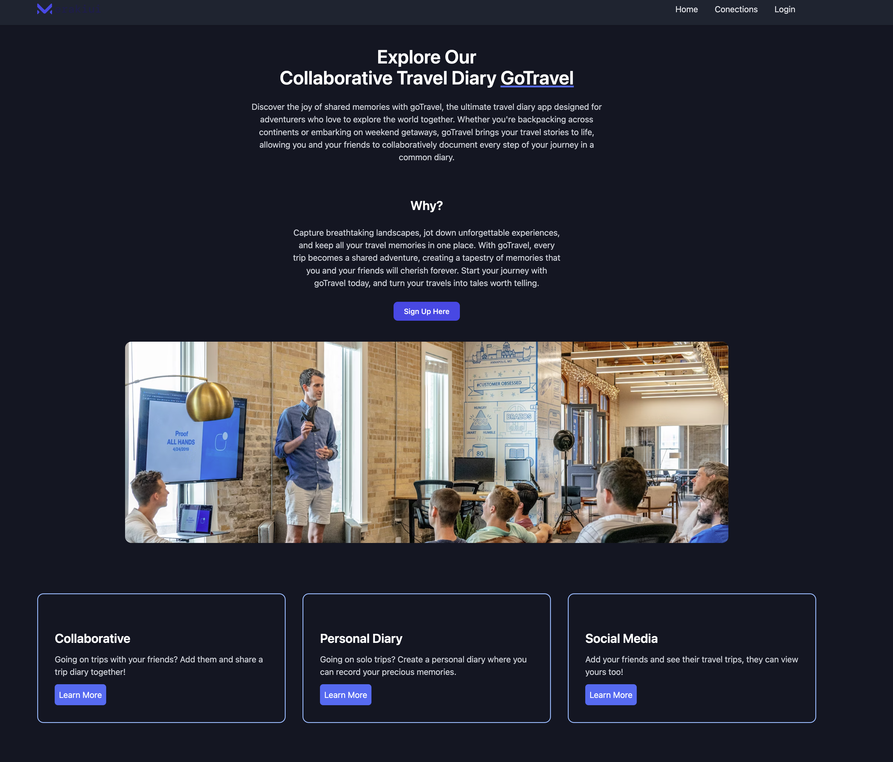

# Travel Social Diary Documentation




## Overview
Travel Social Diary is a social media and travel diary application where users can record their travels in a diary format. Followers can comment on and like their entries.

There are 4 main functionalities:
- User account creation
- Personal travel diary 
- Group (Collaborative) travel diary
- Connect with your friends and share your travel blog


## Table of Contents
- [Backend Architecture](#backend-architecture)
- [User Endpoints](#user-endpoints)
- [Trip Endpoints](#trip-endpoints)
- [Travel Entry Endpoints](#travel-entry-endpoints)
- [Connection Endpoints](#connection-endpoints)

## Backend Architecture

### User authentication


## User Endpoints

### Register User
- **Method:** POST
- **Endpoint:** `/users`
- **Body:**
  ```json
  {
      "User": {
          "Name": "shawn5",
          "Email": "shawn5@gmail.com",
          "Username": "shawn5"
      },
      "Password": "shawn123"
  }
  ```

### View User Detail
- **Method:** GET
- **Endpoint:** `/users/{userId}`

### Update User Details
- **Method:** PATCH
- **Endpoint:** `/users/{userId}/details`
- **Body:**
  ```json
  {
      "email": "shawn"
  }
  ```

### Delete User
- **Method:** DELETE
- **Endpoint:** `/users/{userId}`

## Trip Endpoints

### Start Trip
- **Method:** POST
- **Endpoint:** `/trips`
- **Body:**
  ```json
  {
      "title": "Thailand",
      "country": "Thailand",
      "startdate": "2023-12-02T12:03:03Z",
      "enddate": "2023-12-26T12:03:03Z"
  }
  ```

### View Trip Details
- **Method:** GET
- **Endpoint:** `/trips/{tripId}`

### Change Trip Details
- **Method:** PATCH
- **Endpoint:** `/trips/{tripId}`
- **Body:**
  ```json
  {
      "title": "New Title" 
  }
  ```

### Delete Trip
- **Method:** DELETE
- **Endpoint:** `/trips/{tripId}`

### View All Trips
- **Method:** GET
- **Endpoint:** `/trips`

## Travel Entry Endpoints

### Create Travel Entry
- **Method:** POST
- **Endpoint:** `/travel-entries/`
- **Body formdata:**

  | Param | Value | Type |
  | ----- | ----- | ---- |
  | UserId | `userId` | text |
  | TripId | `tripId` | text |
  | Location | `location` | text |
  | Description | `description` | text |
  | media | `file` | file |

### Get Travel Entry
- **Method:** GET
- **Endpoint:** `/travel-entries/{entryId}`

### Update Travel Entry
- **Method:** PATCH
- **Endpoint:** `/travel-entries/{entryId}`
- **Body:**
  ```json
  {
      "location": "New Location"
  }
  ```

### Delete Travel Entry
- **Method:** DELETE
- **Endpoint:** `/travel-entries/{entryId}`

## Connection Endpoints

### Make Connection
- **Method:** POST
- **Endpoint:** `/connection/{partyA}/{partyB}`

### View Connections
- **Method:** GET
- **Endpoint:** `/connection/{userId}`

### Delete Connection
- **Method:** DELETE
- **Endpoint:** `/connection/{userId}`
- **Query Params:**
  
  | Param | Value |
  | ----- | ----- |
  | targetId | `targetId` |

